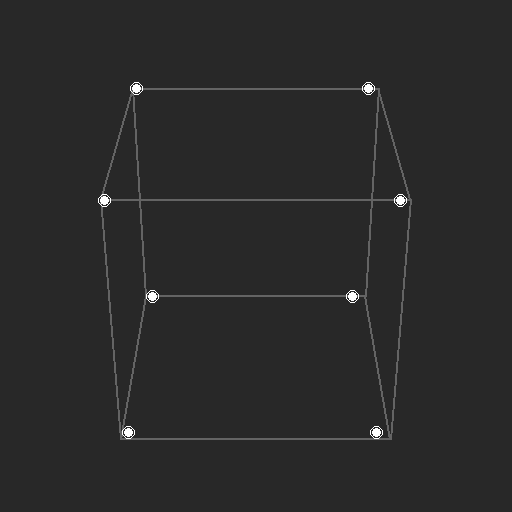
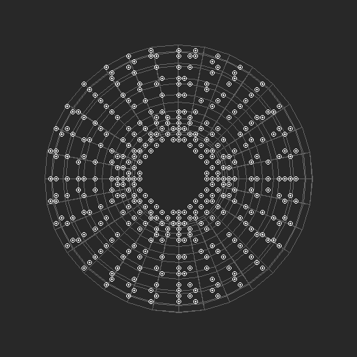
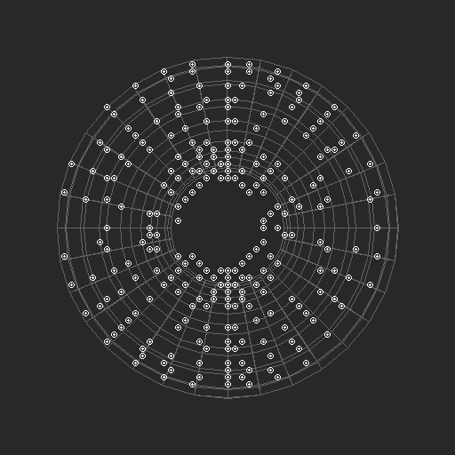

# SIMT Core Architecture Specification

## 1. Executive Summary

The **Kepler-Style SIMT Core** is an **educational, behavioral model** of a General Purpose GPU (GPGPU) processor. Designed for learning and architectural exploration, it implements a 32-thread **Single Instruction, Multiple Threads (SIMT)** architecture compliant with modern GPU execution models. It serves as a study implementation of complex features such as **Dual-Issue Superscalar execution**, **Hardware Divergence Handling**, and **Operand Collection** in SystemVerilog.

### Key Features

- **Architecture**: 5-Stage Pipelined SIMT Core (IF, ID, OC, EX, WB).
- **Parallelism**: 32 Threads per Warp, dual-issue capability (up to 2 instructions/cycle).
- **Multithreading**: Fine-Grained Multithreading (FGMT) with 24 warps (768 threads) and zero-overhead context switching.
- **Memory Model**:
  - **Shared Memory**: 16KB On-Chip Scratchpad (32 banks) with bank-conflict replay.
  - **Global Memory**: Coalesced Load/Store Unit (LSU) with **Multi-Line Split Support**.
  - **MSHR**: Up to 64 outstanding memory transactions per warp with out-of-order completion.
- **Synchronization**: Hardware Barrier (`BAR`) with Epoch consistency.
- **Graphics Pipeline**: Hardware-accelerated 3D wireframe rendering with **Perspective Projection** and dynamic rotation.

### Main Implementation

The core logic is implemented in [streaming_multiprocessor.sv](../Core/streaming_multiprocessor.sv), which contains the complete 5-stage pipeline, warp scheduler, scoreboard, and execution units.

---

## 2. Microarchitecture Specification

### 2.1 Pipeline Overview

The core implements an in-order, dual-issue 5-stage pipeline with out-of-order memory completion.


#### Stage 1: IF (Instruction Fetch)

- **Warp Scheduler**: Utilizes a Loose Round-Robin policy to select "Ready" warps.
- **Fetch Unit**: Retrieves a 64-bit instruction bundle (PC and PC+4 (implied)) from I-Cache/Instruction Memory.
- **Throughput**: capable of fetching 2 consecutive instructions for the selected warp.

#### Stage 2: ID (Instruction Decode & Issue)

- **Decoding**: 64-bit Instruction words are decoded into opcode, register indices, and immediate values.
- **Scoreboard**: A bit-vector scoreboard tracks pending register writes to enforce RAW (Read-After-Write) and WAW (Write-After-Write) dependencies.
- **Dual-Issue Logic**: The scheduler attempts to issue two consecutive instructions (A and B) simultaneously. The following table shows valid pairings:

| Instruction A Type                  | Can Pair With | Cannot Pair With | Reason                          |
| :---------------------------------- | :------------ | :--------------- | :------------------------------ |
| **ALU** (ADD, SUB, MUL, etc.)       | FPU, LSU, SFU | ALU, CTRL        | Same functional unit conflict   |
| **FPU** (FADD, FMUL, FFMA, etc.)    | ALU, LSU, SFU | FPU              | Same functional unit conflict   |
| **LSU** (LDR, STR, LDS, STS)        | ALU, FPU, SFU | LSU              | Only 1 memory port per warp     |
| **SFU** (SIN, COS, RSQ, etc.)       | ALU, FPU, LSU | SFU              | Same functional unit conflict   |
| **CTRL** (BRA, BEQ, BNE, BAR, etc.) | _None_        | All              | Control flow must execute alone |

**Additional Constraints:**

- **RAW Hazard**: Instruction B cannot read a register that A writes (checked via scoreboard).
- **WAW Hazard**: Both instructions cannot write to the same destination register.
- **Control Flow**: Branches (`BRA`, `BEQ`, `BNE`), barriers (`BAR`), synchronization (`SSY`, `JOIN`), and function calls (`CALL`, `RET`) **always issue alone**.

#### Stage 3: OC (Operand Collector)

- **Function**: Buffers instructions and gathers source operands from the Register File.
- **Conflict Resolution**: Arbitrates access to the banked Register File to handle bank conflicts without stalling the main pipeline.
- **Forwarding**: Implements "Snoop-based Forwarding" to capture data directly from the Writeback bus, bypassing register reads for back-to-back dependent instructions.

#### Stage 4: EX (Execute)

- **ALU**: 32-lane integer arithmetic logic unit (ADD, SUB, BITWISE, SHIFT).
- **FPU**: IEEE-754 Single Precision Floating Point Unit (based on [Hardfloat](https://github.com/ucb-bar/berkeley-hardfloat)).
- **SFU**: Special Function Unit for transcendental functions (SIN, COS, RSQ).
- **Branch Unit**: Evaluates conditions and manages the Divergence Stack.

#### Stage 5: MEM (Memory)

- **LSU**: Handles `LDR`/`STR` (Global) and `LDS`/`STS` (Shared) operations.
- **Address Calculation**: Computes effective addresses and manages coalescing.

#### Stage 6: WB (Writeback)

- **Writeback Arbiter**: Selects results from ALU, FPU, and Memory subsystems.
- **Register File Update**: Writes data back to the register file and clears Scoreboard entries.

### 2.2 Thread Hierarchy & Scheduling

- **Warp Organization**:
  - **32 Threads per Warp**: Executed in lockstep (SIMT).
  - **24 Warps per Core**: Supporting up to 768 concurrent threads resident on the SM.
  - **Warp ID**: 5-bit identifier (0-23).

- **Multithreading Model**:
  - **Fine-Grained Multithreading (FGMT)**: The core can switch between warps on a cycle-by-cycle basis to hide latency.
  - **Latency Hiding**: When a warp stalls (scoreboard dependency, memory wait, barrier), the scheduler immediately switches to another ready warp.

- **Scheduling & Switching Rule**:
  - **Greedy Scheduling**: The scheduler **stays with the same warp** as long as it has eligible instructions (no scoreboard conflicts, no resource stalls).
  - **When do Warps Switch?**: Warps switch when:
    1. The current warp **stalls** (RAW dependency, memory operation pending, barrier wait).
    2. The current warp **completes** (hits `EXIT` or diverges to inactive state).
  - **Two-Loop Search Mechanism**: When a new warp is needed, the scheduler uses a two-loop search:
    - **Outer Loop**: Iterates through all 24 warp slots starting from `rr_ptr` (round-robin pointer).
    - **Inner Check**: For each warp, checks if it's eligible (state = READY, no scoreboard conflicts, operand collector has space).
    - **First-Match**: Selects the **first eligible warp** found and breaks the search.
    - **Pointer Update**: After selection, `rr_ptr` advances to `(selected_warp + 1) % 24`, ensuring fairness and preventing starvation.
  - **Context Switching Overhead**: **Zero Cycles**. All warp architectural state (PC, Registers, Active Mask) is fully resident in hardware, allowing instantaneous switching without saving/restoring context to memory.

#### Warp Switching in Action (Simulation Evidence)

The following log snippets from `test_multi_warp_torus.sv` demonstrate real-time warp switching behavior during the 512-thread torus rendering benchmark.

**Example 1: Greedy Scheduling - Same Warp Executes Consecutively**

When a warp is ready and others are stalled, the scheduler **stays with the same warp** (greedy behavior):

```text
[13795000] ALU EXEC: Warp=4 PC=0000003b Op=OP_BNE  Mask=ffffffff
[13805000] ALU EXEC: Warp=4 PC=0000003c Op=OP_BAR  Mask=ffffffff  <- Same warp continues
[13815000] ALU EXEC: Warp=4 PC=0000003d Op=OP_EXIT Mask=ffffffff  <- Still Warp 4
[13825000] ALU EXEC: Warp=14 PC=00000038 Op=OP_OR  Mask=00000004  <- Switch (Warp 4 exited)
```

Another example showing Warp 3 executing 5 consecutive instructions:

```text
[14565000] ALU EXEC: Warp=3 PC=0000003b Op=OP_BNE  Mask=ffffffff
[14585000] ALU EXEC: Warp=3 PC=0000003c Op=OP_BAR  Mask=ffffffff  <- Greedy: same warp
[14595000] ALU EXEC: Warp=3 PC=0000003d Op=OP_NOP  Mask=ffffffff
[14605000] ALU EXEC: Warp=3 PC=0000003e Op=OP_NOP  Mask=00000000
[14615000] ALU EXEC: Warp=3 PC=0000003f Op=OP_NOP  Mask=00000000  <- 5th consecutive
[14645000] ALU EXEC: Warp=3 PC=00000035 Op=OP_MOV  Mask=ffffffff  <- Still Warp 3!
[14655000] ALU EXEC: Warp=11 PC=0000003a Op=OP_ADD Mask=ffffffff  <- Finally switches
```

**Example 2: Round-Robin Fairness When Multiple Warps Ready**

At simulation start, all 16 warps are ready and none are stalled. In this case, the scheduler cannot be "greedy" with any single warp because **all warps have equal priority**. Round-robin ensures fairness and prevents starvation:

```text
[995000]  ALU EXEC: Warp=0  PC=00000000 Op=OP_MOV Mask=ffffffff  <- RR pointer starts at 0
[1005000] ALU EXEC: Warp=1  PC=00000000 Op=OP_MOV Mask=ffffffff  <- RR advances to 1
[1015000] ALU EXEC: Warp=2  PC=00000000 Op=OP_MOV Mask=ffffffff  <- RR advances to 2
[1025000] ALU EXEC: Warp=3  PC=00000000 Op=OP_MOV Mask=ffffffff
...
[1145000] ALU EXEC: Warp=15 PC=00000000 Op=OP_MOV Mask=ffffffff  <- RR reaches 15
[1155000] ALU EXEC: Warp=0  PC=00000001 Op=OP_MOV Mask=ffffffff  <- RR wraps back to 0
```

**Why not greedy here?** Greedy scheduling means "stay with the current warp **if it's ready and others are stalled**". When all warps are equally ready, round-robin takes precedence to distribute execution time fairly. This prevents a single warp from monopolizing the pipeline.

**Example 3: Out-of-Order Execution Due to Memory Stalls**

When warps stall on memory/scoreboard, the scheduler skips them and finds the next ready warp:

```text
[4035000] ALU EXEC: Warp=8  PC=00000015 Op=OP_MUL Mask=ffffffff
[4045000] ALU EXEC: Warp=12 PC=00000015 Op=OP_MUL Mask=ffffffff  <- Skipped 9,10,11 (stalled)
[4055000] ALU EXEC: Warp=13 PC=00000015 Op=OP_MUL Mask=ffffffff
...
[4175000] ALU EXEC: Warp=9  PC=00000015 Op=OP_MUL Mask=ffffffff  <- Warp 9 resumes after stall
[4185000] ALU EXEC: Warp=10 PC=00000015 Op=OP_MUL Mask=ffffffff
[4195000] ALU EXEC: Warp=11 PC=00000015 Op=OP_MUL Mask=ffffffff
```

**Summary**: The scheduler is **greedy-first** (stays with the current warp while it's ready), then uses **round-robin** to find the next ready warp when switching is required.

---

## 3. Instruction Set Architecture (ISA) Reference

### 3.1 Instruction Encoding Format (64-bit)

The ISA uses a fixed 64-bit instruction length to accommodate 3 source registers, a destination, predicates, and immediate values.

```text
 63      56 55      48 47      40 39      32 31    28 27            20 19                   0
+----------+----------+----------+----------+--------+----------------+---------------------+
|  OPCODE  |    RD    |   RS1    |   RS2    |  PRED  |  RS3 / EXTRA   |      IMMEDIATE      |
+----------+----------+----------+----------+--------+----------------+---------------------+
|  8-bits  |  8-bits  |  8-bits  |  8-bits  | 4-bits |     8-bits     |       20-bits       |
+----------+----------+----------+----------+--------+----------------+---------------------+
```

- **OPCODE**: Specifies the operation (e.g., `ADD`, `LDR`, `BRA`).
- **RD**: Destination Register Index (R0-R63).
- **RS1 / RS2**: Source Register Indices.
- **PRED**: Predicate Register Index (P0-P7) and Condition Flags (Negation).
- **RS3 / EXTRA**: Third Source Register (for FMA) or Branch Target Offset (high bits).
- **IMMEDIATE**: 20-bit Signed Immediate / Offset.

### 3.2 Opcode Map

#### Integer Arithmetic & Logic

| Opcode | Mnemonic | Description                                   |
| :----- | :------- | :-------------------------------------------- |
| `0x00` | `NOP`    | No Operation                                  |
| `0x01` | `ADD`    | Integer Add (`Rd = Rs1 + Rs2`)                |
| `0x02` | `SUB`    | Integer Subtract (`Rd = Rs1 - Rs2`)           |
| `0x03` | `MUL`    | Integer Multiply (`Rd = Rs1 * Rs2`)           |
| `0x05` | `IMAD`   | Integer Multiply-Add (`Rd = Rs1 * Rs2 + Rs3`) |
| `0x06` | `NEG`    | Integer Negation (`Rd = -Rs1`)                |
| `0x36` | `IDIV`   | Signed Integer Division (`Rd = Rs1 / Rs2`)    |
| `0x37` | `IREM`   | Signed Integer Remainder (`Rd = Rs1 % Rs2`)   |
| `0x38` | `IABS`   | Integer Absolute Value (`Rd = \|Rs1\|`)       |
| `0x39` | `IMIN`   | Signed Integer Minimum (`Rd = min(Rs1, Rs2)`) |
| `0x3A` | `IMAX`   | Signed Integer Maximum (`Rd = max(Rs1, Rs2)`) |
| `0x07` | `MOV`    | Move / Load Immediate                         |
| `0x50` | `AND`    | Bitwise AND                                   |
| `0x51` | `OR`     | Bitwise OR                                    |
| `0x52` | `XOR`    | Bitwise XOR                                   |
| `0x53` | `NOT`    | Bitwise NOT                                   |
| `0x60` | `SHL`    | Shift Left Logical                            |
| `0x61` | `SHR`    | Shift Right Logical                           |
| `0x62` | `SHA`    | Shift Right Arithmetic                        |

#### Comparison & Predication

| Opcode | Mnemonic | Description                                   |
| :----- | :------- | :-------------------------------------------- |
| `0x04` | `SLT`    | Set Less Than (Integer)                       |
| `0x70` | `SLE`    | Set Less Equal (Integer)                      |
| `0x71` | `SEQ`    | Set Equal (Integer)                           |
| `0x80` | `ISETP`  | Integer Set Predicate (`P1 = (Rs1 op Rs2)`)   |
| `0x81` | `FSETP`  | Float Set Predicate (`P1 = (Rs1 op Rs2)`)     |
| `0x82` | `SELP`   | Select with Predicate (`Rd = P1 ? Rs1 : Rs2`) |

#### Floating Point (FPU)

| Opcode | Mnemonic | Description                                 |
| :----- | :------- | :------------------------------------------ |
| `0x30` | `FADD`   | Floating Point Add                          |
| `0x31` | `FSUB`   | Floating Point Subtract                     |
| `0x32` | `FMUL`   | Floating Point Multiply                     |
| `0x33` | `FDIV`   | Floating Point Divide                       |
| `0x35` | `FFMA`   | Fused Multiply-Add (`Rd = Rs1 * Rs2 + Rs3`) |
| `0x3B` | `FMIN`   | Floating Point Minimum                      |
| `0x3C` | `FMAX`   | Floating Point Maximum                      |
| `0x3D` | `FABS`   | Floating Point Absolute Value               |
| `0x54` | `FNEG`   | Floating Point Negation                     |
| `0x34` | `FTOI`   | Float to Integer Conversion                 |
| `0x3E` | `ITOF`   | Integer to Float Conversion                 |

#### Special Function Unit (SFU)

| Opcode | Mnemonic | Description                                   |
| :----- | :------- | :-------------------------------------------- |
| `0x40` | `SIN`    | Sine (`Rd = sin(Rs1)`)                        |
| `0x41` | `COS`    | Cosine (`Rd = cos(Rs1)`)                      |
| `0x42` | `EX2`    | Base-2 Exponent (`Rd = 2^Rs1`)                |
| `0x43` | `LG2`    | Base-2 Logarithm (`Rd = log2(Rs1)`)           |
| `0x44` | `RCP`    | Reciprocal (`Rd = 1 / Rs1`)                   |
| `0x45` | `RSQ`    | Reciprocal Square Root (`Rd = 1 / sqrt(Rs1)`) |
| `0x46` | `SQRT`   | Square Root (`Rd = sqrt(Rs1)`)                |
| `0x47` | `TANH`   | Hyperbolic Tangent (`Rd = tanh(Rs1)`)         |

#### Bit Manipulation

| Opcode | Mnemonic | Description                                       |
| :----- | :------- | :------------------------------------------------ |
| `0x68` | `POPC`   | Population Count (Count Set Bits)                 |
| `0x69` | `CLZ`    | Count Leading Zeros                               |
| `0x6A` | `BREV`   | Bit Reverse                                       |
| `0x6B` | `CNOT`   | Conditional Logical Not (`Rd = (Rs1==0) ? 1 : 0`) |

#### Memory Operations

| Opcode | Mnemonic | Description                    |
| :----- | :------- | :----------------------------- |
| `0x10` | `LDR`    | Load Register (Global Memory)  |
| `0x11` | `STR`    | Store Register (Global Memory) |
| `0x12` | `LDS`    | Load Shared Memory             |
| `0x13` | `STS`    | Store Shared Memory            |

#### Control Flow

| Opcode | Mnemonic | Description                                         |
| :----- | :------- | :-------------------------------------------------- |
| `0x20` | `BEQ`    | Branch if Equal (`if (Rs1 == Rs2) PC = Target`)     |
| `0x21` | `BNE`    | Branch if Not Equal (`if (Rs1 != Rs2) PC = Target`) |
| `0x22` | `BRA`    | Unconditional Branch                                |
| `0x23` | `SSY`    | Set Sync Point (Push Divergence Stack)              |
| `0x24` | `JOIN`   | Converge Threads (Pop Divergence Stack)             |
| `0x25` | `BAR`    | Barrier Synchronization                             |
| `0x26` | `TID`    | Get Thread ID (`Rd = LaneID`)                       |
| `0x27` | `CALL`   | Function Call (Push Return Stack)                   |
| `0x28` | `RET`    | Function Return (Pop Return Stack)                  |
| `0xFF` | `EXIT`   | Terminate Program                                   |

---

## 4. Subsystem Deep Dive

### 4.1 Operand Collector (OC)

The Operand Collector is a critical microarchitectural feature inspired by NVIDIA Fermi/Kepler architectures. It decouples the fetching of instructions from the reading of operands.

- **Motivation**: Register File banks are single-ported. If an instruction needs operands `R0` (Bank 0) and `R4` (Bank 0), it cannot read both in one cycle.
- **Mechanism**:
  1.  Instructions are allocated to a **Collector Unit (CU)**.
  2.  The CU requests operands from the **Bank Arbiter**.
  3.  The Arbiter grants access based on bank availability (Interleaved Layout: `Bank = RegID % 4`).
  4.  Once all operands are collected, the CU becomes **READY** and dispatches to the Execution Units.

  

### 4.2 Divergence Stack (SSY/JOIN)

To handle **Single Instruction, Multiple Threads (SIMT)** divergence on control flow, the core maintains a per-warp **Divergence Stack**.

- **Divergence & Serialization**: When a condition (`if (tid < 16)`) splits the warp, the hardware:
  1.  Pushes the current `Active Mask`, `PC`, and `Token` onto the stack via `SSY`.
  2.  Updates the `Active Mask` to only enable threads taking the branch (e.g., threads 0-15).
  3.  **Serializes execution**: Threads 0-15 execute the "then" path while threads 16-31 are masked off (inactive).
  4.  After the "then" path completes, the hardware flips the mask to execute the "else" path with threads 16-31 active.
- **Re-convergence**: When all divergent paths complete, a `JOIN` instruction:
  1. Pops the stack.
  2. Restores the full `Active Mask`, re-activating all threads.

This hardware mechanism allows for nested branches and loops without software overhead. **Key Point**: Divergent paths are executed **serially** (one after another), not in parallel, which can reduce effective throughput when warps diverge frequently.


### 4.3 Shared Memory System

- **Capacity**: 16KB per Streaming Multiprocessor (SM).
- **Layout**: 32 Banks (word-interleaved).
- **Conflict Handling**: The Shared Memory Controller detects if multiple threads address the same bank in the same cycle. Implementation creates a **Replay Trap**, serializing the conflicting requests over multiple cycles to ensure correctness.

### 4.4 Barrier Synchronization (Epoch Consistency)

"Epoch consistency" in the context of the hardware barrier (`BAR`) refers to a protection mechanism against **race conditions** that can occur when warps executing in parallel have different execution speeds (the "fast-warp" problem).

- **The Problem**: Imagine a loop with a `BAR`. If a fast warp reaches the barrier, waits, releases, and rapidly hits the _same_ barrier again in the next iteration before a slow warp has even reached it the _first_ time, the barrier logic could get confused (counting the fast warp's second arrival as the slow warp's first).
- **The Solution**: The core implements a `barrier_epoch` bit that toggles every time the barrier resolves. Warps track their local "Seen Epoch". A warp contributes to the barrier only if its local epoch matches the global barrier epoch, ensuring that all warps must fully exit synchronization phase `N` before any can enter `N+1`.


### 4.5 Predicated Execution

The core supports **per-thread predication** to enable fine-grained conditional execution without branching.

- **Predicate Registers**: Each thread has **7 predicate registers** (P0-P6), plus an implicit **P7** which is always `true`.
- **Setting Predicates**: Comparison instructions (`ISETP`, `FSETP`) evaluate conditions and write boolean results to predicate registers:
  ```assembly
  ISETP.LT P1, R0, R1    ; P1 = (R0 < R1) for each thread
  ```
- **Conditional Execution**: Instructions can be predicated using the `PRED` field in the instruction encoding:
  ```assembly
  @P1 ADD R2, R3, R4     ; Only execute if P1 is true for this thread
  @!P1 SUB R2, R3, R4    ; Only execute if P1 is false (negated)
  ```
- **Execution Mask**: During execution, the final active mask is computed as:
  ```
  exec_mask = warp_active_mask & predicate_mask
  ```
  Threads with `exec_mask[i] = 0` are masked off and do not write results.

**Use Case**: Predicates allow simple conditionals without divergence overhead. For example, `if (x > 0) y = x * 2` can be implemented as:

```assembly
ISETP.GT P1, R_x, 0
@P1 MUL R_y, R_x, 2
```


- **LSU Split Handling**: The LSU automatically detects when a warp's memory accesses span multiple 128-byte cache lines. It utilizes a **Replay Queue** to serialize these into multiple sequential requests to the memory system, transparently to the warp scheduler.

- **MSHR (Miss Status Holding Registers)**: Each warp has a **64-entry MSHR table** that tracks pending memory operations, allowing the core to hide massive memory latencies.
  - **Transaction ID**: Each memory request is assigned a unique 16-bit ID composed of:
    - `[5:0]` Slot ID (0-63) within the warp's MSHR
    - `[9:6]` Warp ID (0-23)
    - `[15:10]` SM ID (for multi-SM systems)
  - **FIFO Management**: Free Transaction IDs are managed via a per-warp FIFO. When a load/store issues, it pops an ID; when the response arrives, the ID is reclaimed.

- **Out-of-Order Completion**: Memory responses can arrive in any order. The MSHR table maps each Transaction ID back to:
  - Destination register (`rd`)
  - Active thread mask
  - Original memory addresses (for unpacking responses)

- **Scoreboard Clearing**: When a memory response arrives, the corresponding register's scoreboard bit is cleared, allowing dependent instructions to proceed.

**Example Flow**:

1. Warp 0 issues `LDR R5, [addr]` → Allocates Transaction ID `0x0010` (Slot 16, Warp 0)
2. Request sent to memory with ID `0x0010`
3. Warp 0 continues executing other instructions (R5 is scoreboarded)
4. Memory responds with ID `0x0010` → MSHR lookup → Write data to R5 → Clear scoreboard

**Transaction ID Reclamation**:
To prevent resource exhaustion, Transaction IDs must be recycled after use:

1. **Initialization**: At reset, all 64 Transaction IDs (0x0000-0x003F for Warp 0) are pushed into the warp's FIFO.
2. **Allocation**: When a `LDR`/`STR` issues, the core pops an ID from the FIFO. If the FIFO is empty, the warp stalls until an ID becomes available.
3. **Reclamation**: When a memory response arrives:
   - The MSHR entry is marked invalid (`mshr_valid[warp][slot] = 0`)
   - The Transaction ID is pushed back into the FIFO
   - The MSHR slot becomes available for reuse
4. **Store Completion**: For stores (`STR`), the ID is reclaimed immediately after the write is acknowledged (no data to return).

**Critical Constraint**: A warp can have at most **64 outstanding memory operations**. If all IDs are in use, the warp stalls at the LSU stage until at least one response arrives and reclaims an ID.

**Data Hazard Prevention with Out-of-Order Completion**:
Even though memory responses arrive out-of-order, **RAW (Read-After-Write) hazards are prevented** through the scoreboard:

1. **Scoreboard Set on Issue**: When `LDR R5, [addr]` issues, the scoreboard bit for R5 is **immediately set** (before the memory request is sent).
2. **Dependent Instructions Stall**: Any subsequent instruction that reads R5 (e.g., `ADD R6, R5, R7`) is blocked at the ID stage by the scoreboard check.
3. **Scoreboard Clear on Response**: When the memory response for R5 arrives (possibly out-of-order with other loads), the scoreboard bit is cleared, allowing dependent instructions to proceed.
4. **No WAW Hazard**: Multiple loads to the same register are prevented by the scoreboard (second load cannot issue until first completes).

**Example with Out-of-Order Completion**:

```assembly
LDR R1, [addr1]   ; Issues at cycle 10, scoreboard R1 = 1
LDR R2, [addr2]   ; Issues at cycle 11, scoreboard R2 = 1
ADD R3, R1, R2    ; STALLS at ID stage (R1 and R2 scoreboarded)
```

- Memory response for R2 arrives at cycle 50 → Clear scoreboard R2
- Memory response for R1 arrives at cycle 60 → Clear scoreboard R1
- `ADD` can now proceed (both operands ready)

**Key Insight**: The scoreboard acts as a **reservation system**, ensuring that even if R2's data arrives before R1's, the `ADD` instruction only proceeds when **both** operands are available.

### 4.7 Return Address Stack (CALL/RET)

The core supports **hardware function calls** via a per-warp Return Address Stack.

- **Stack Depth**: 8 levels per warp (supports up to 8 nested function calls)
- **CALL Instruction**: Pushes the return address (`PC + 1`) onto the stack and branches to the target
- **RET Instruction**: Pops the return address from the stack and resumes execution
- **Stack Pointer**: Each warp maintains a 3-bit stack pointer (`warp_ret_ptr`)

**Limitation**: Stack overflow (>8 nested calls) results in undefined behavior. This is sufficient for most GPU kernels, which typically avoid deep recursion.

### 4.8 Pipeline Hazards & Squashing

The core handles **control flow changes** (branches, divergence) by squashing incorrectly fetched instructions.

- **Branch Tag**: Each warp has a 2-bit `branch_tag` that increments on every branch/divergence event
- **Tag Propagation**: Instructions carry the branch tag from the warp at fetch time
- **Squash Detection**: If an instruction's tag doesn't match the current warp tag, it's from a mispredicted path
- **Shadow NOP**: Squashed instructions are converted to "Shadow NOPs":
  - They propagate through the pipeline to clear scoreboard bits
  - They do **not** write to registers or memory
  - This prevents deadlock from scoreboard entries that would never clear

**Example**:

1. Warp 0 fetches instructions at PC=10, PC=11 (tag=0)
2. Branch at PC=10 redirects to PC=50 → `branch_tag` increments to 1
3. Instruction at PC=11 (tag=0) reaches EX stage
4. Tag mismatch detected (0 ≠ 1) → Convert to Shadow NOP
5. Shadow NOP clears scoreboard for any destination register, preventing deadlock

---

## 5. Verification & Performance

### 5.1 Methodology

The core is verified using a layered SystemVerilog testbench (`TB/`) running actual **CUDA-like** assembly kernels.

## 5.2 Benchmark: 8x8 Tiled Matrix Multiplication Dem

The core includes a robust testbench (`TB/TB_SV/test_app_matmul.sv`) that verifies a **Tiled Matrix Multiplication** algorithm. This test performs `C = A * B` for 8x8 matrices using a CUDA-like assembly kernel.

### Memory Layout

- **Matrix A (8x8)**: Global Address `0` to `255` (Row-major).
- **Matrix B (8x8)**: Global Address `256` to `511` (Row-major).
- **Matrix C (8x8)**: Global Address `1024` to `1279`.
- **Shared Memory**: 16KB available (Base `0` used for Tile A, Base `256` for Tile B).

### Why Tiling & Shared Memory?

**Problem**: Naive matrix multiplication requires each thread to load the same row/column elements from global memory multiple times. For an 8x8 matrix, this results in **64 global memory accesses per thread** (8 loads of A, 8 loads of B, repeated 8 times).

**Solution**: Tiling with shared memory provides:

1. **Data Reuse**: Load each tile into shared memory **once**, then reuse it across all threads in the warp. This reduces global memory traffic by **~8x**.
2. **Low Latency**: Shared memory has **~100x lower latency** than global memory (~1-2 cycles vs ~100-400 cycles).
3. **Bandwidth Efficiency**: Coalesced loads from global memory maximize memory bandwidth utilization.

**Result**: The tiled implementation completes in **487 cycles**, whereas a naive implementation would require **~3000+ cycles** due to repeated global memory stalls.

### Kernel Assembly Code

The following is the actual assembly program executed by the cores. It demonstrates **Shared Memory Tiling**, **Barrier Synchronization**, and **Fused Multiply-Add**.

```assembly
// 1. Thread Initialization
MOV R15, 0          ; Constant Zero
TID R0              ; R0 = Lane ID (0-31)
MOV R10, 0          ; R10 = Shared Base A
MOV R11, 256        ; R11 = Shared Base B
MOV R12, 1024       ; R12 = Global Base C

// 2. Load Tile from Global -> Shared
// Calculate Global Address
MOV R6, R0          ; simple 1-1 mapping for 8x8 block
SHL R14, R6, 2      ; R14 = Byte Offset (TID * 4)

// Load A[tid] -> SharedA[tid]
LDR R7, [R14 + 0]   ; Load from Global A
STS [R14 + 0], R7   ; Store to Shared A

// Load B[tid] -> SharedB[tid]
ADD R5, R14, 256    ; Offset for B
LDR R7, [R5 + 0]    ; Load from Global B
STS [R5 + 0], R7    ; Store to Shared B

// 3. Barrier Synchronization
BAR                 ; Wait for all threads to load Shared Memory

// 4. Compute Dot Product (8 iterations)
// Setup coordinates
SHR R1, R6, 3       ; Row = TID / 8
AND R2, R6, 7       ; Col = TID % 8
MOV R3, 0           ; Unroll Loop for k=0..7

// Pointers
SHL R4, R1, 5       ; RowOffset = Row * 32
ADD R7, R10, R4     ; PtrA = SharedBaseA + RowOffset
SHL R4, R2, 2       ; ColOffset = Col * 4
ADD R8, R11, R4     ; PtrB = SharedBaseB + ColOffset

// Inner Loop (x8 unrolled)
LDS R9, [R7]        ; Load A[Row][k]
LDS R4, [R8]        ; Load B[k][Col]
IMAD R3, R9, R4, R3 ; Accumulate: R3 += A * B
ADD R7, R7, 4       ; Increment PtrA
ADD R8, R8, 32      ; Increment PtrB (Stride 8 words)
// ... repeat 7 more times ...

// 5. Store Result
SHL R4, R6, 2       ; Offset = TID * 4
ADD R5, R12, R4     ; Address = BaseC + Offset
STR [R5 + 0], R3    ; Store Result C[tid]
EXIT
```

### Verification Output

The simulation initializes `A` with linear values (1..64) and `B` as an Identity matrix. The expected result `C` is identical to `A`.

```text
Verify: Matrix A (Input)
  [    1    2    3    4    5    6    7    8 ]
  [    9   10   11   12   13   14   15   16 ]
  [   17   18   19   20   21   22   23   24 ]
  [   25   26   27   28   29   30   31   32 ]
  [   33   34   35   36   37   38   39   40 ]
  [   41   42   43   44   45   46   47   48 ]
  [   49   50   51   52   53   54   55   56 ]
  [   57   58   59   60   61   62   63   64 ]

Verify: Matrix B (Input)
  [    1    0    0    0    0    0    0    0 ]
  [    0    1    0    0    0    0    0    0 ]
  [    0    0    1    0    0    0    0    0 ]
  [    0    0    0    1    0    0    0    0 ]
  [    0    0    0    0    1    0    0    0 ]
  [    0    0    0    0    0    1    0    0 ]
  [    0    0    0    0    0    0    1    0 ]
  [    0    0    0    0    0    0    0    1 ]

Verify: Matrix C (Result)
  [    1    2    3    4    5    6    7    8 ]
  [    9   10   11   12   13   14   15   16 ]
  [   17   18   19   20   21   22   23   24 ]
  [   25   26   27   28   29   30   31   32 ]
  [   33   34   35   36   37   38   39   40 ]
  [   41   42   43   44   45   46   47   48 ]
  [   49   50   51   52   53   54   55   56 ]
  [   57   58   59   60   61   62   63   64 ]
=======================================================

TEST PASSED!
Total Cycles: 487
```

### 5.3 Benchmark: 3D Wireframe Cube with Perspective

The core is capable of full 3D graphics orchestration. A dedicated demo (`TB/TB_SV/test_perspective_cube.sv`) implements:

- **Assembly Shader**: A vertex shader executing 3D rotations (Y-dynamic, X-static) and perspective projection.
- **Math Engine**: Utilizes the **SFU** for trigonometric functions and **IDIV** for depth-based coordinate scaling ($x_{proj} = x \cdot f / z$).
- **Rendering**: Directly writes projected vertices into the $64 \times 64$ framebuffer in global memory.



### 5.4 Benchmark: Parallel Perspective Pyramid (SIMT)

This benchmark (`TB/TB_SV/test_parallel_pyramid.sv`) parallelizes the rendering of a 5-vertex square pyramid. Each vertex is assigned to a unique SIMT thread, demonstrating vertex puller efficiency.

- **Outcome**: Verifies correct handled of scatter/gather memory accesses during vertex fetch and predicated atomic writes to the framebuffer.


### 5.5 Benchmark: High-Density Parallel Torus (Stress Test)

The most sophisticated stress test for the core (`TB/TB_SV/test_parallel_torus.sv`). It renders a **512-vertex** parametric torus using a full 32-thread warp.

- **Complexity**: 32 Parallel threads (Tube) x 16 Serial iterations (Ring).
- **Hardware Hazard Verification**: Targets the **Hardware Predicate Scoreboard**. The shader performs `ISETP` immediately followed by predicated `LDR`/`STR`, verifying that the RTL automatically stalls the pipeline to prevent RAW hazards on predicate bits.
- **Dynamic Animation**: Features a **Diagonal Tumble** (clockwise rotation on both X and Y axes) implemented via dynamic instruction patching during the simulation loop.



### 5.6 Benchmark: Multi-Warp Parallel Torus (512-Thread SIMT Saturation)

The ultimate stress test for the SM (`TB/TB_SV/test_multi_warp_torus.sv`). Even though the work-load is same as the single-warp torus, this benchmark saturates the core by running **16 warps in parallel**, with each warp computing a different ring cross-section of the torus.

- **Thread Organization**:
  - **16 Warps** (Warp 0-15) → Theta index (Ring cross-section)
  - **32 Threads/Warp** → Phi index (Tube segments)
  - **Total: 512 Active Threads** computing 512 unique vertices simultaneously

- **Hardware Stress Targets**:
  1. **Warp Scheduler**: Validates round-robin fairness under maximum occupancy
  2. **MSHR Contention**: 16 warps competing for memory transactions
  3. **Predicate Scoreboard**: Each warp uses `ISETP` + predicated `LDR`/`STR` in a serialization loop
  4. **Barrier Synchronization**: All 16 warps synchronize via `BAR` before frame completion
  5. **LSU Arbitration**: Heavy global memory traffic from concurrent warps

- **Vertex Mapping**:

  ```
  Vertex(WarpID, ThreadID) = Torus(theta=WarpID*22.5°, phi=ThreadID*11.25°)
  ```

- **Animation**: 60-frame diagonal tumble rotation (X and Y axes synchronized)

**Performance**: Completes in ~7,400 cycles per frame with all 512 threads active.



### 5.8 Throughput Analysis: Single vs. Multi-Warp Execution

The architecture's ability to hide latency through multi-warp interleaving is vividly demonstrated by comparing the Single-Warp and 16-Warp Torus benchmarks. Both tests generate **identical geometry** (a 512-vertex Torus mesh), but the 16-Warp version achieves significantly higher throughput by filling stall cycles (memory/SFU latency) with instructions from other warps.

| Metric                   | **Single-Warp** (`test_parallel_torus`) | **16-Warp** (`test_multi_warp_torus`) |
| :----------------------- | :-------------------------------------- | :------------------------------------ |
| **Logic**                | 1 Warp loops 16 times (Serial)          | 16 Warps execute once (Parallel)      |
| **Total Threads**        | 32 Active                               | 512 Active                            |
| **Avg Cycles per Frame** | **~29,363**                             | **~7,415**                            |
| **Throughput**           | 0.017 vertices/cycle                    | 0.069 vertices/cycle                  |
| **Performance Gain**     | 1x (Baseline)                           | **~3.96x Faster**                     |

**Key Insight**: The Single-Warp test spends ~75% of its time stalled waiting for high-latency SFU (`SIN`/`COS`) and Global Memory operations. The 16-Warp test successfully hides this latency, keeping the execution pipelines saturated.

### 5.7 Limitations & Future Work

- **Rasterization**: Currently supports point-based vertex rendering; full triangle rasterization is a future milestone.
- **L1 Cache**: While the LSU supports splits, the current model uses a `mock_memory`. Integration with a genuine set-associative L1 cache is planned as a next step.

---

## 6. RTL Design Hierarchy

The RTL implementation is organized under the `RTL/` directory:

```
RTL/
├── Core/                           # Main SIMT Core
│   ├── streaming_multiprocessor.sv # Top-level SM module (6-stage pipeline)
│   ├── simt_pkg.sv                 # Package with types, opcodes, functions
│   └── shared_memory.sv            # 16KB shared memory (32 banks)
│
├── Compute/                        # Execution Units
│   ├── ALU.sv                      # Integer ALU (32-lane)
│   ├── Addition-Subtraction.sv     # Adder/Subtractor unit
│   ├── Multiplication.sv           # Integer multiplier
│   ├── Division.sv                 # Integer divider
│   ├── FPU.sv                      # Floating-point unit
│   ├── SFU.sv                      # Special function unit (SIN, COS, RSQ)
│   └── [additional compute units]
│
├── Memory/                         # Memory Subsystem
│   ├── operand_collector.sv        # Operand collector with bank arbitration
│   ├── fifo.sv                     # Generic FIFO module
│   └── mock_memory.sv              # Mock global memory for simulation
│

```

### Key Modules

| Module                        | Description                                     | Lines of Code |
| :---------------------------- | :---------------------------------------------- | :------------ |
| `streaming_multiprocessor.sv` | Top-level SM with complete 6-stage pipeline     | ~2,161        |
| `operand_collector.sv`        | Banked register file with conflict resolution   | ~222          |
| `simt_pkg.sv`                 | Package definitions (opcodes, types, functions) | ~413          |
| `shared_memory.sv`            | 32-bank shared memory with conflict detection   | ~107          |
| `ALU.sv`                      | 32-lane integer arithmetic logic unit           | ~500+         |
| `FPU.sv`                      | IEEE-754 floating-point unit                    | ~300+         |
| `SFU.sv`                      | Transcendental function unit                    | ~200+         |

---

## 7. Testbench File Hierarchy

The verification environment is organized under the `TB/` directory:

```
TB/
├── TB_SV/                          # SystemVerilog Testbenches
│   ├── test_alu_ops.sv             # Basic integer arithmetic
│   ├── test_app_matmul.sv          # 8x8 Tiled Matrix Multiplication
│   ├── test_control_flow.sv        # Nested branches and divergence
│   ├── test_fpu_sfu_ops.sv         # FPU and Transcendental functions
│   ├── test_function_call.sv       # CALL/RET hardware stack
│   ├── test_lsu_split.sv           # Memory coalescing and split requests
│   ├── test_memory_system.sv       # MSHR and transaction tracking
│   ├── test_multi_warp_torus.sv    # Multi-Warp Torus (16 warps, 512 threads)
│   ├── test_parallel_cube.sv       # Parallel (SIMT) 3D vertex shader
│   ├── test_parallel_pyramid.sv    # SIMT Pyramid Renderer (5 threads)
│   ├── test_parallel_torus.sv      # High-Density Torus (32 threads, 512 vertices)
│   ├── test_perspective_cube.sv    # 3D Rendering with Perspective
│   ├── test_pipeline_issue.sv      # Dual-issue structural hazards
│   ├── test_rotated_cube.sv        # Orthographic 3D rotation
│   └── test_wireframe_cube.sv      # Basic wireframe orthographic demo
├── run_regression.sh               # Regression test runner
├── verify_specific.sh              # Single test runner
└── obj_dir/                        # Verilator build artifacts
```

### Running Tests

**Run all regression tests:**

```bash
cd TB
./run_regression.sh
```

**Run a specific test:**

```bash
cd TB
# Example: Running the MatMul test
./verify_specific.sh TB_SV/test_app_matmul.sv

# Example: Running the Torus animation benchmark
./verify_specific.sh TB_SV/test_parallel_torus.sv

# Example: Running the Multi-Warp Torus (512-thread stress test)
./verify_specific.sh TB_SV/test_multi_warp_torus.sv
```

### Animation & Visualization

To generate 3D animations after running a graphical benchmark (e.g., Torus, Cube, Pyramid):

1. **Prerequisites**: Ensure you have Python 3 and the `Pillow` library installed.

   ```bash
   pip install Pillow
   ```

2. **Generate GIF**: The simulation saves frame artifacts as `.ppm` files in the temporary build directory (`/tmp/gpu_verify_specific/`). Use the provided Python scripts to compile them:
   - **For Single-Warp Torus**:
     ```bash
     cd TB
     python3 visualize_torus.py "/tmp/gpu_verify_specific/torus_frame_*.ppm" torus_animation.gif
     ```
   - **For Multi-Warp Torus (512 threads)**:
     ```bash
     cd TB
     python3 visualize_torus.py "/tmp/gpu_verify_specific/multi_warp_torus_frame_*.ppm" frames/multi_warp_torus_animation.gif
     ```
   - **For Wireframe Cube**:
     ```bash
     cd TB
     python3 visualize_fb.py "/tmp/gpu_verify_specific/frame_*.ppm" cube_animation.gif
     ```

3. **Check Output**: The script will process the individual frames and save an optimized animated GIF.

### Test Coverage

The testbench suite verifies:

- Dual-issue instruction scheduling
- Warp divergence and re-convergence (SSY/JOIN)
- Barrier synchronization with epoch consistency
- Shared memory banking and conflict handling
- Predicated execution
- Matrix multiplication with tiling
- Thread ID generation
- Out-of-order memory completion
- LSU Multi-Line Split Handling
- 3D Perspective Projection & Rotation
- Parallel Vertex Processing (SIMT)
- Hardware Predicate Scoreboard & Hazard Stalling
- High-Density Compute Saturation (512+ Vertices)
- Multi-Warp Saturation (16 Warps, 512 Threads)
- MSHR Contention under Heavy Load
